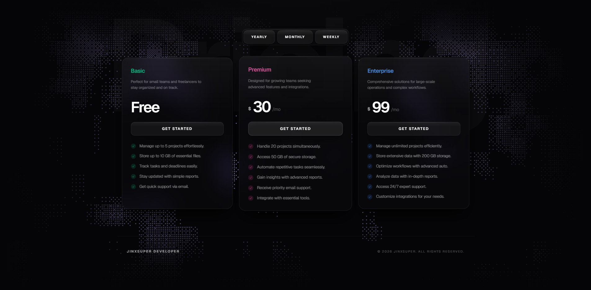

# JinXSuper Pricing Section

A modern, responsive pricing section component built with React and Tailwind CSS. Perfect for SaaS products, services, and subscription-based businesses.

## Preview

## Tech Stack

- **React 19**
- **Next.js 16**
- **Tailwind CSS 4**
- **Framer Motion**
- **Locomotive Scroll**

## Features

- 🎨 Modern glassmorphism design
- 💳 Three pricing tiers (Basic, Premium, Enterprise)
- 🔄 Interval toggle (Yearly, Monthly, Weekly)
- ✨ Smooth animations and transitions
- 📱 Fully responsive design
- 🎯 Easy to customize
- ⚡ High-performance component
- 🌙 Dark theme optimized

## Pricing Tiers

### Basic
- Free plan
- Perfect for small teams and freelancers
- Manage up to 5 projects
- 10 GB storage
- Basic support

### Premium
- $30/month
- Designed for growing teams
- Handle 20 projects
- 50 GB secure storage
- Priority email support

### Enterprise
- $99/month
- Comprehensive solutions for large-scale operations
- Unlimited projects
- 200 GB storage
- 24/7 expert support

## Documentation

See the implementation details in [walkthrough.md](./walkthrough.md).

## License

Open source. Feel free to use in your projects.

## Developed by

[JinXSuper](https://jinxsuper.vercel.app)

---

© 2025 JinXSuper. All rights reserved.
